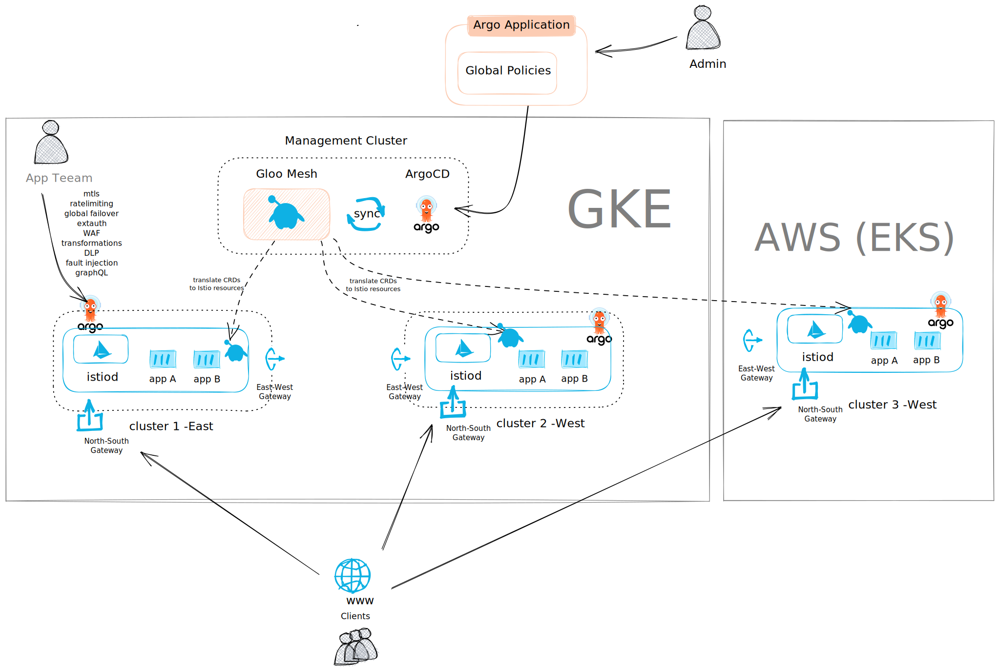
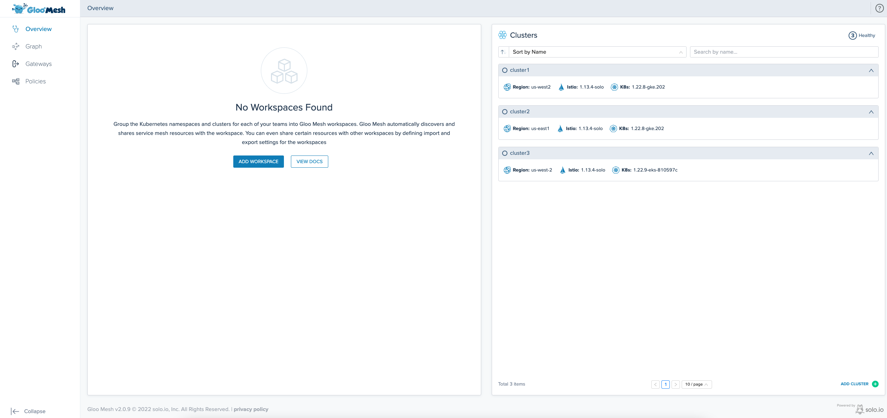

# <center>Gloo Mesh - GitOPS</center>


## The Goal of this document

Use gitops to deploy an application on multiple clusters (Multi cloud provider), and use Gloo Mesh to deploy traffic and security policies and monitor the environment. 




## Introduction <a name="introduction"></a>

[Gloo Mesh Enterprise](https://www.solo.io/products/gloo-mesh/) is a management plane which makes it easy to operate [Istio](https://istio.io) on one or many Kubernetes clusters deployed anywhere (any platform, anywhere).

### Istio support

The Gloo Mesh Enterprise subscription includes end to end Istio support:

- Upstream first
- Specialty builds available (FIPS, ARM, etc)
- Long Term Support (LTS) N-4 
- Critical security patches
- Production break-fix
- One hour SLA Severity 1
- Install / upgrade
- Architecture and operational guidance, best practices

### Gloo Mesh overview

Gloo Mesh provides many unique features, including:

- multi-tenancy based on global workspaces
- zero trust enforcement
- global observability (centralized metrics and access logging)
- simplified cross cluster communications (using virtual destinations)
- advanced gateway capabilities (oauth, jwt, transformations, rate limiting, web application firewall, ...)


### Want to learn more about Gloo Mesh

You can find more information about Gloo Mesh in the official documentation:
[https://docs.solo.io/gloo-mesh/latest/](https://docs.solo.io/gloo-mesh/latest/)


# GitOps 

GitOps is becoming increasingly popular approach to manage Kubernetes components. It works by using Git as a single source of truth for declarative infrastructure and applications, allowing your application definitions, configurations, and environments to be declarative and version controlled. This helps to make these workflows automated, auditable, and easy to understand.

To learn move about GitOps and how it can be leveraged with solo.io product check the following link [https://www.solo.io/gitops/](https://www.solo.io/gitops/)

This repo is using the App of Apps pattern, more info [here](https://argo-cd.readthedocs.io/en/stable/operator-manual/cluster-bootstrapping/#app-of-apps-pattern)

# Let's get started

## Prerequisites [Step 0]


### Make this repo your own
 
- Please fork this repo, and replace all occurrences in the forked project of `https://github.com/asayah/gloo-mesh-zi/` to point to your forked repo and push the changes to your repo. (do not create a PR to merge with original repo). 


### Environment 

We will need 4 clusters 
- 3 in GKE (4 nodes, 4CPU min, 8Go min per Node)
- 1 in EKS (4 nodes, 4CPU min, 8Go min per Node)

You can use the basic script in ./misc to create them. 

Note: The cluster should be able to create LB that are publicly reachable. or at least reachable to all the clusters listed above. 
The Lb address of the Gloo Mesh service can be found using this command: 

```bash
kubectl --context ${mgmt_context} -n gloo-mesh get svc gloo-mesh-mgmt-server -o jsonpath='{.status.loadBalancer.ingress[0].*}'
```
Make sure that the address retrieved by the command above is reachable from all the other clusters, on port 9900. 

After creating the clusters, rename the Kubernetes contexts to: 
- mgmt: the management cluster 
- cluster1: 1st workload cluster in GKE 
- cluster2: 2nd workload cluster in GKE 
- cluster3: 3rd cluster in GKE


## Deploy Argo and install Istio + Gloo mesh

Run the following script to deploy the stack: 

```bash 
./deploy.sh
```

### Understand the deployment

The `deploy.sh` script will install the following: 
- ArgoCD will be installed on the 4 clusters

- ArgoCD App for **Cluster configuration**  will be installed, installing cert manager and creating the namespaces in each clusters
- ArgoCD App for **Infra configuration**  will be installed, installing Gloo Mesh and Istio in each cluster
- ArgoCD App for **App configuration**  will be installed, installing the demo application (book info) in each workload cluster
- ArgoCD App for **Mesh configuration**  will be installed, installing required configuration on the management plane cluster (for example workspaces) and installing workload configuration in each workload cluster (like routeTables for routing...)

### Argo Application: Infra configuration

```
apiVersion: argoproj.io/v1alpha1
kind: Application
metadata:
  name: meta-mgmt-cluster-config
  namespace: argocd
  finalizers:
  - resources-finalizer.argocd.argoproj.io
spec:
  project: default
  source:
    repoURL: https://github.com/asayah/gloo-mesh-zi/
    targetRevision: main
    path: environments/mgmt/cluster-config/active/
  destination:
    server: https://kubernetes.default.svc
  syncPolicy:
    automated:
      prune: false
      selfHeal: false

```
This will deploy everything under `./environments/mgmt/cluster-config/active/` to your `mgmt` cluster, the similar pattern is followed for `cluser1`, `cluser2` and `cluser3`. 

The **Cluster configuration** contains some essential components that will be needed later, for example cert-manager, and will create the namespaces that are required to deploy istio and gloo mesh. 

Note: we are creating separate namespaces for istiod (istio-system) and the istio ingress gateways (istio-gateways), this is to follow a good pattern of separate the gateways installing from the istiod installation. 


### Argo Application: Infra configuration

Following the same pattern as in the previous step, this time we are installing the infra layer, here we will be installing the an Argo application in each of our clusters to deploy everything under `./environments/<environment>/infra/active`


### Argo Application: Infra configuration

Following the same pattern as in the previous step, this time we are installing the application layer, here we will be installing the an Argo application in each of our clusters to deploy everything under `./environments/<environment>/apps/active`


### Argo Application: Mesh configuration

Following the same pattern as in the previous step, this time we are installing the application layer, here we will be installing the an Argo application in each of our clusters to deploy everything under `./environments/<environment>/mesh-config/active`


### Validation

Let's access Gloo Mesh UI to see if Everything got installed correctly

```bash
kubectl port-forward -n gloo-mesh svc/gloo-mesh-ui 8090 --context mgmt
```

You should see that 3 workload clusters get created: 



You can also access the ArgoCD UI in each cluster: 

```bash
kubectl port-forward svc/argocd-server -n argocd 9999:443 --context mgmt 
```
Using the username/password `admin/solo.io`


